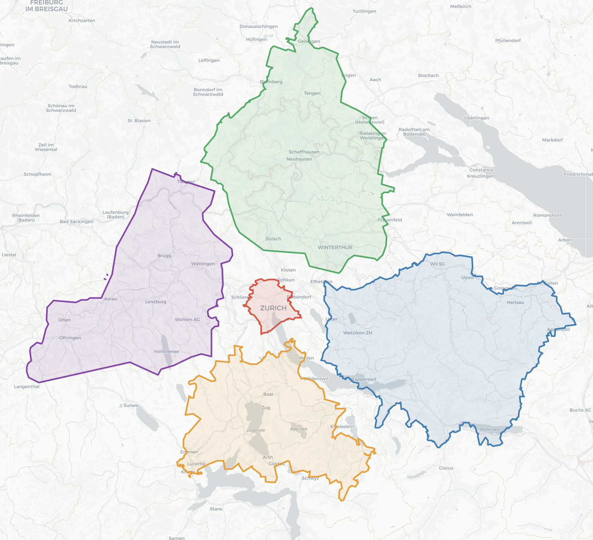

# City Sizes

Overlay city boundaries (from OpenStreetMap) true to scale to compare their
sizes — anchored to a reference city whose outline aligns with the real map
underneath.

**Live demo: <https://fsvbach.github.io/city-sizes/>**



## Features

- **Add cities** by name — Nominatim resolves the query, and the list shows
  the official name, so wrong matches stand out.
- **Reference city** (radio button): the whole arrangement shifts rigidly so
  that city's outline matches the map; relative positions are kept.
- **Move cities**: click an outline to select it, then drag. Clicking the
  active reference radio re-aligns it with the map.
- **Colors**: click a swatch to open a color picker.
- **Legend** (top bar): full panel, names only (visible cities alphabetically,
  without colors, sizes or tooltips — nothing reveals which outline is which),
  or hidden.
- **Copy link** (top bar): a link that reproduces the current view including
  the legend mode — with "Show names only" active it's a quiz. The link holds
  only OSM ids; boundaries are fetched from Nominatim when it is opened.
- **Save / Load** (top bar): export/import the assembled comparison as
  self-contained JSON (geometry included, no network needed to load).
  Hidden cities are not saved.

## Usage

```bash
python3 -m http.server 8080   # then open http://localhost:8080
```

On startup the app loads `data/zurich-2.json`. To change the default, Save
your arrangement and point `DEFAULT_COMPARISON_URL` in `js/app.js` at the
file. When opened via `file://`, browsers block reading the default file —
use the Load button instead.

Map tiles need a free [CARTO Basemaps key](https://carto.com/basemaps/apikey/),
restricted to the serving host and set in `js/config.js` (a localhost key goes
in the gitignored `js/config.local.js`). Without a key, Esri's key-free grey
tiles are used instead.

## How it works

Boundaries come from Nominatim as simplified GeoJSON (cached for 7 days,
max. 1 request/s). Each city is projected into local meters around its area
centroid (equirectangular, `cos(φ)`-corrected), which preserves true size
ratios across latitudes. Outlying islands and exclaves (Hamburg's Neuwerk,
Tokyo's island chains) are dropped so they don't bias centroid, area, or
extent, while contiguous city islands like New York's boroughs are kept.
The meter coordinates are then re-anchored on the reference city and drawn
with Leaflet (largest city at the bottom). Caveat: some regions map their
boundaries into the sea (e.g. Japanese prefectures), which inflates areas
beyond official land figures.

## Data

Map data © [OpenStreetMap](https://www.openstreetmap.org/copyright)
contributors (ODbL) · tiles © [CARTO](https://carto.com/attributions)
(or © [Esri](https://www.esri.com/) when no key is configured) ·
boundaries via [Nominatim](https://nominatim.org/)
